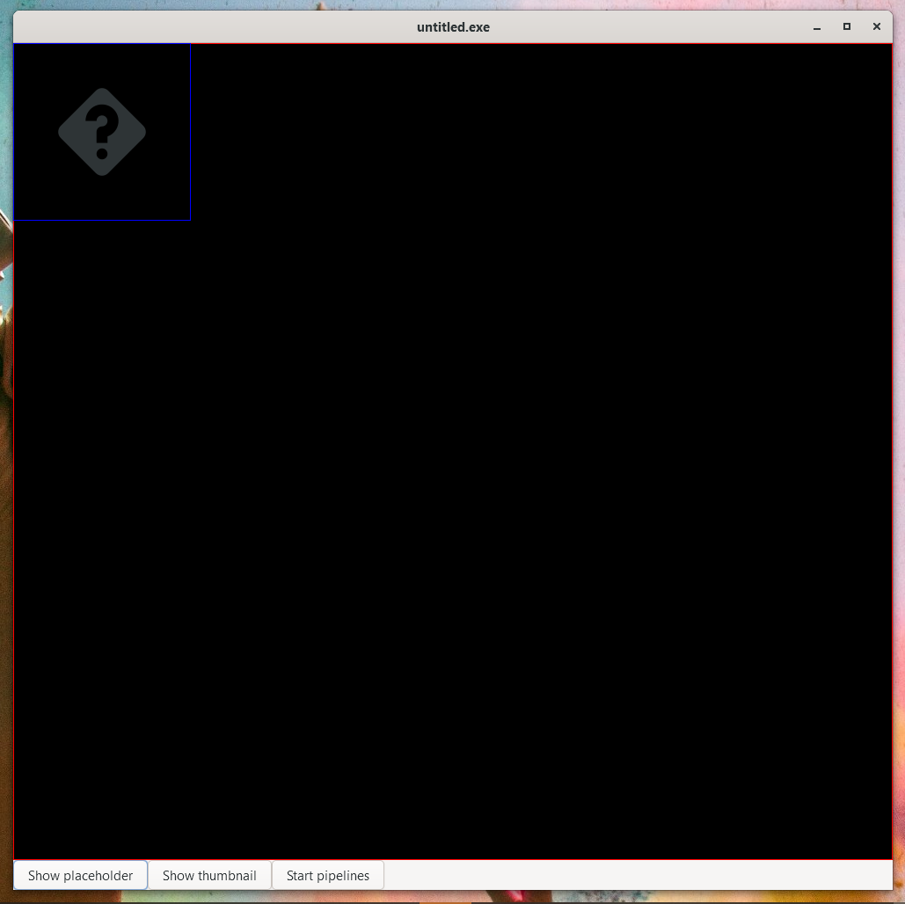
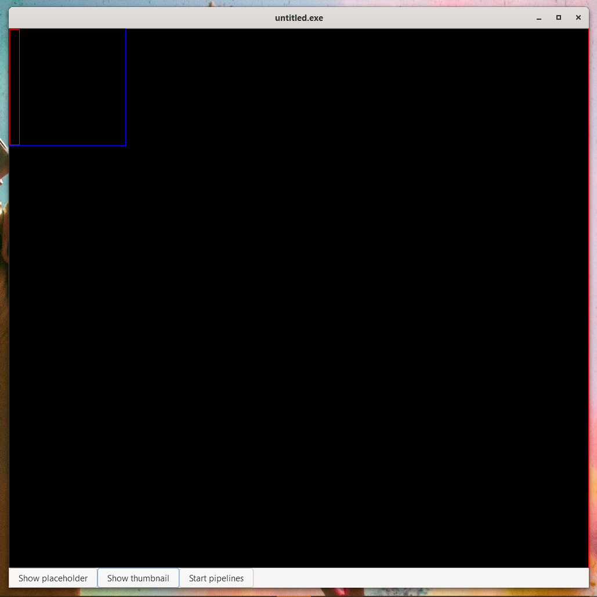
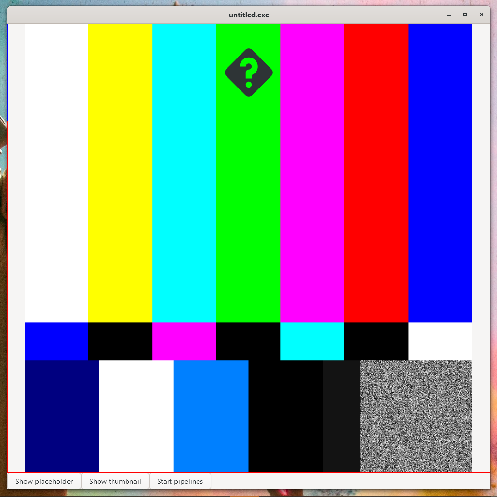
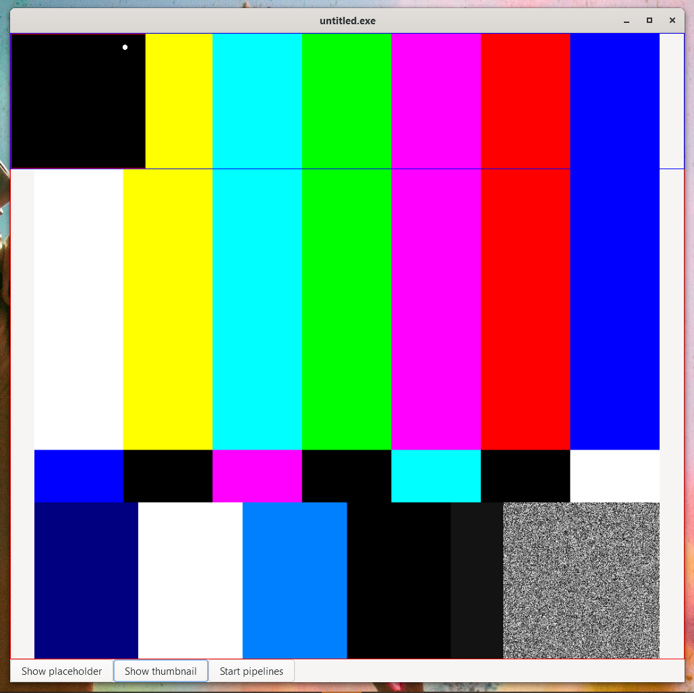

Before the pipeline starts, the overlayed widget keeps the right size.

Also the GtkPicture which would have the video painted onto.

But, as soon as the pipeline starts, the upper widget gets resized.

Even though the GtkPicture being scaled down propertly, it seems that the parent expands without reason.
